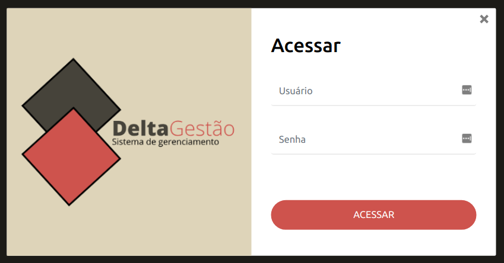

# CRM - Delta Gestão

Um sistema para gestão de empresas do ramo de material de construção, desenvolvido com exclusividade para uma empresa. Minha atuação neste projeto foi desenvolvedor full stack criando algo único e exclusivo.

O sistema funciona na rede interna da empresa.

---

## Integrações do sistema:
- **Gestão de estoque** Cadastro de produtos, controle de estoque, compra de produtos, análise de estoque, controle de fornecedores.
- **Gestão Financeira** Controle de vendas, controle de fluxo de caixa, controle de contas recebidas e a receber e relatórios bem detalhados para um análise mais precisa na tomada de decisões.
- **Frente de Venda** Módulo exclusivo para venda no balcão, com uma interface bem prática para agilizar no momento da venda do produto.
- **Frente de Caixa** Módulo exclusivo para fluxo de caixa diário.
---

## Habilidades usadas
A principal tecnologia utilizada para o backend foi **nodeJS, usando sequelize para trabalhar com o banco de dados, e usando express**. Demais tecnologia usadas para construção desse crm:
- HTML5
- CSS3
- JavaScript
- Bootstrap
- Banco de dados MariaDB
- EJS
- Docker
- [Tema Utilizado para dashboard](https://themes.getbootstrap.com/preview/?theme_id=93682)

---

## Imagens

 

 

---

## Autor

Fabiano Basso Antonio.

I also work as a **FULL STACK DEVELOPER** freelancer, if you have a project, this is the right time to get it off the ground, we can talk, and I'll present the best solution for you.

## My contacts
**Portfólio:** https://fabianobasso.github.io/

**Linkedin:** https://www.linkedin.com/in/fabiano-basso

**Whatsapp:** [Send Message](https://api.whatsapp.com/send?phone=5519999979098)
