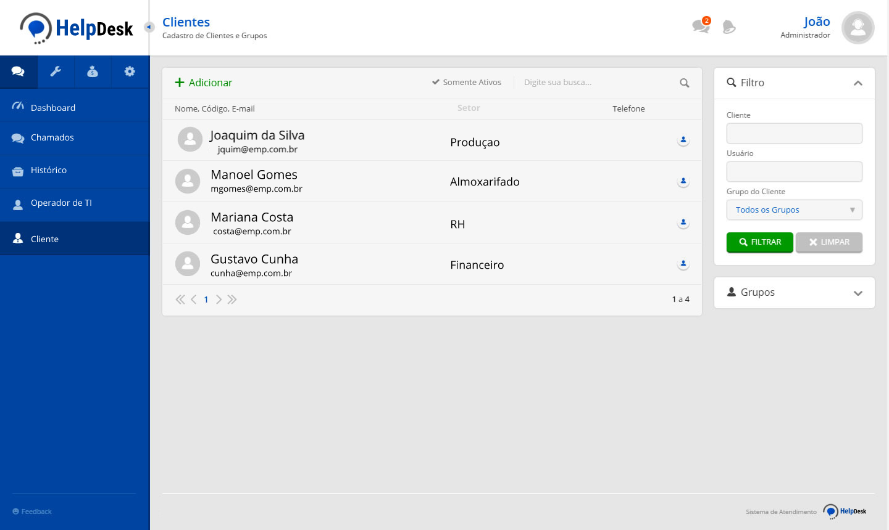

# Sistema de Ordem de serviço interna

Sistema desenvolvido para uma empresa com uma demanda bem elevada de equipamentos de informática( Computadores, Notebooks, Tablets ) que tinha como necessidade informatizar a abertura de chamados internos do setor de TI, para ter uma maior controle de todos as ordens de serviço abertas em um só lugar.

O sistema funciona em rede interna da empresa facilitando a abertura de um chamado para setor de TI, que por sua parte faz o gerenciamento dos atendimentos.

---

## Integrações do sistema:
- **Controle de Chamados** A dashboard do setor de TI, acesso a todos os chamados abertos, um gerenciamento completo com praticidade.
- **Área do usuário** Uma dashboard prática, para abertura de chamado e acompanhamento
- **Histórico** Um módulo exclusivo com cadastro de cada equipamento da empresa com suas informações técnicas para facilitar ainda mais o atendimento.

---

## Habilidades usadas
A principal tecnologia utilizada para o backend foi **nodeJS, usando sequelize para trabalhar com o banco de dados, e usando express**. Demais tecnologia usadas para construção:
- HTML5
- CSS3
- JavaScript
- Bootstrap
- Banco de dados MariaDB
- EJS
- Docker

---

## Imagens

 

 

---

## Autor

Fabiano Basso Antonio.

I also work as a **FULL STACK DEVELOPER** freelancer, if you have a project, this is the right time to get it off the ground, we can talk, and I'll present the best solution for you.

## My contacts
**Portfólio:** https://fabianobasso.github.io/

**Linkedin:** https://www.linkedin.com/in/fabiano-basso

**Whatsapp:** [Send Message](https://api.whatsapp.com/send?phone=5519999979098)
