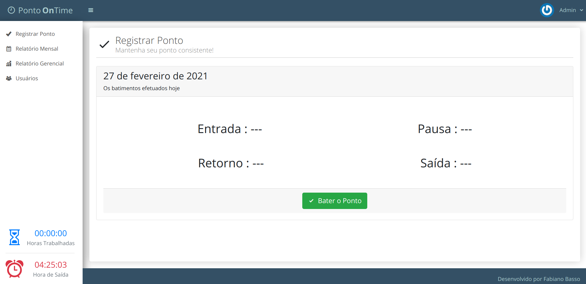

# Sistema de Ponto Online

Esse sistema foi desenvolvido para uma empresa que no momento da pandemia precisa que os funcionários continuassem a registrar o ponto de forma online.
Não é um projeto que funciona de forma global e de uso exclusivo da empresa onde a empresa disponibiliza o link para os seus funcionários.

---

## Integrações do sistema:
- **Dashboard Usuário** O usuário entra com seu login e senha para acessar sua dashboard, para efetuar suas entrada e saída de ponto, consegue avisar qualquer ocorrência pela falta de batimento do seu ponto.
- **Dashboard RH** Essa é acessada por membros do setor de rh da empresa, onde tem os relatórios de completo para fazer os devidos tratamento, é possível ainda exportar e um arquivo json e ser importado em outro sistema caso seja necessário.
**Proteção** Todas as informações de batimento de ponto estão protegidas sem a permissão de edição de qualquer dado.
---

## Habilidades usadas
Sistema construído usando php, sem uso de nenhum framework, porém usando uma estrutura MVC exclusiva para esse projeto. Demais tecnologias usadas no projeto:
- HTML5
- CSS3
- JavaScript
- Bootstrap
- Banco de dados MariaDB

---

## Imagens
**Uma prévia do sistema**
 

 

Caso tenha algum interesse nesse projeto por favor entre em contato, meus contatos estão logo abaixo.

---

## Autor

Fabiano Basso Antonio.

I also work as a **FULL STACK DEVELOPER** freelancer, if you have a project, this is the right time to get it off the ground, we can talk, and I'll present the best solution for you.

## My contacts
**Portfólio:** https://fabianobasso.github.io/

**Linkedin:** https://www.linkedin.com/in/fabiano-basso

**Whatsapp:** [Send Message](https://api.whatsapp.com/send?phone=5519999979098)
