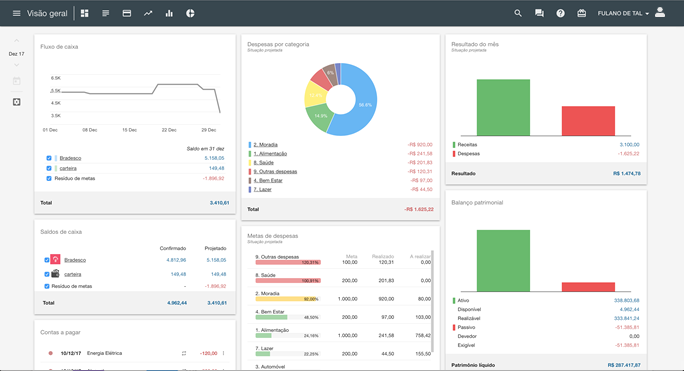

# Sistema para Gestão Financeira

Esse é um projeto que fui contratado para desenvolver para um cliente que estava com problemas de gerenciar seus gastos mensal.

---

## Integrações do sistema:
- **Lançamento de gasto:** Consegue entrar com todos os gastos mensal de forma fácil sem uso de planilhas, para ter um maior controle de seu gasto mensal em uma interface bem amigável e de fácil uso fácil.
- **Relatórios:** relatórios para ajudar a controlar os gastos mensal.

---

## Habilidades usadas
Sistema construído em node.js usando express com engine ejs, as demais tecnologia usadas:
- HTML5
- CSS3
- Bootstrap
- Banco de dados Sqlite

---

## Imagens
**Uma prévia da dashboard do sistema**

Caso tenha algum interesse nesse projeto por favor entre em contato, meus contatos estão logo abaixo.

---

## Autor

Fabiano Basso Antonio.

I also work as a **FULL STACK DEVELOPER** freelancer, if you have a project, this is the right time to get it off the ground, we can talk, and I'll present the best solution for you.

## My contacts
**Portfólio:** https://fabianobasso.github.io/

**Linkedin:** https://www.linkedin.com/in/fabiano-basso

**Whatsapp:** [Send Message](https://api.whatsapp.com/send?phone=5519999979098)
